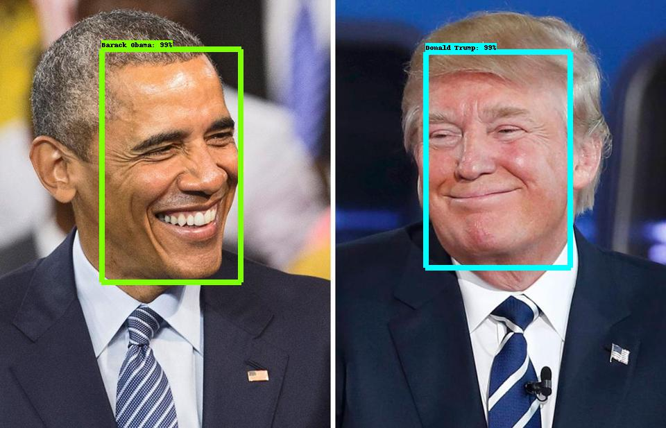

# Face Recognition with the TensorFlow Object Detection API


### Note: Tensorflow object detection is an accurate machine learning API capable of localizing and identifying multiple objects in a single image. You can use the API for multiple use cases like object detection , person recognition, text detection, etc..
Today, we will see together how tensorflow can recognize people. In this post I'll outline the steps I took to get from a collection of Celebrities images (crawled from the internet)

1. Data Set Download
2. Image Annotation
3. Xml to CSV
4. TF-Record Creation 
5. Label Map preparation
6. Pipeline Configuration
7. Training
8. Exporting Graph


## 1. Data set Download

You can crawl celebrity pictures from google images if you don't have a ready Data set. Try to order the data set as bellow:

```

CelebrityDB/
    TomHanks/
        img001.jpg
        tomhanks.jpg
        ...
    WillSmith/
        willsmith1.jpg
        will-smith-pic.jpg
        ...
    ... 

```
## 2. Image Annotation
you can annotate the images using an annotation tool like labelImg. But it will take a lot of time. That's why i created a script to generate xml files(exactly like PASCAL VOC). I used opencv to detect faces but, you can change it with any other tool( i recommend dlib or a neural network face detection model which are much more accurate than opencv).
#### Use [python annotation script to generate xml annotations](annotation.py)
The Xml files should look like :
```xml
<annotation verified="yes">
    <folder>celebrityDB</folder><filename>1d9k49.jpeg</filename>
    <path>/media/emna/datapartition/tutos/celebrityDB/dewayneJohnson/1d9k49.jpeg</path>
    <source>
        <database>Emna Amor</database>
    </source>
    <size>
        <width>104</width>
        <height>142</height>
        <depth>3</depth>
    </size>
    <segmented>0</segmented>
    <object>
        <name>dewayneJohnson</name>
        <pose>Unspecified</pose>
        <truncated>0</truncated>
        <difficult>0</difficult>
        <bndbox>
            <xmin>2</xmin>
            <ymin>34</ymin>
            <xmax>133</xmax>
            <ymax>99</ymax>
        </bndbox>
    </object>
</annotation>
```
## 3. XML tO CSV
After annotating the pictures we have, We need to generate a csv file containing all pictures details / classes. 
 #### Use  [python xml to csv script to generate the csv file](xml_to_csv.py)
The csv File should look like this:


| filename | width | height | class | xmin | ymin | xmax | ymax | 
| --- | --- | --- | --- | --- | --- | --- | --- |
| 1jth1461.jpeg | 76 | 105 | kimKardashian | 10 | 30 | 89 | 59 |
| wenn33850496.jpg | 470 | 654 | AndySerkis | 52 | 142 | 494 | 352 |

Then we need to split the data into train and test using [this python notebook ](split_data.ipynb.ipynb).

### 4. TF-Record Creation 
To train our model, we need to convert the data to Tensorflow file format called Tfrecords. Most of the batch operations aren’t done directly from images, rather they are converted into a single tfrecord file (images which are numpy arrays and labels which are a list of strings).
#### WHAT IS TFRECORD?
```
 “… TFRECORD is an approach that convert whatever data you have into a supported format. This approach makes it easier to mix and match data sets and network architectures. The recommended format for TensorFlow is a TFRecords file containing tf.train.Example protocol buffers (which contain Features as a field).“
```
Use this [python script](generate_tfrecords.py) to generate te tf records files (train.record  and test.record) 
```
Usage:
  # Create train data:
  python generate_tfrecords.py --csv_input=train.csv  --output_path=data/train.record

  # Create test data:
  python generate_tfrecords.py --csv_input=test.csv  --output_path=data/test.record
```
###### Note: do not forget to edit the generate_tfrecords file with your own labels.

### 5. Label Map preparation
Use the same order you appended the labels in the generate_tfrecords python script 
###### Note: label map id should be diffirent to 0 !
```
item {
  id: 1
  name: 'AndySerkis'
}

item {
  id: 2
  name: 'dewayneJohnson'
}
item {
  id: 3
  name: 'drake'
}

item {
  id: 4
  name: 'jayZ'
}

item {
  id: 5
  name: 'justinBieber'
}

item {
  id: 6
  name: 'kimKardashian'
}


item {
  id: 7
  name: 'kimKardashian'
}

item {
  id: 8
  name: 'tomHanks'
}

item {
  id: 9
  name: 'willSmith'
}

```
### Pipeline Configuration
We will use [ssd_mobilenet_v1_coco](http://download.tensorflow.org/models/object_detection/ssd_mobilenet_v1_coco_2018_01_28.tar.gz) to train our face recognition model.
#### Do not forget to edit [the ssd_mobilenet_v1_coco.config file](data/ssd_mobilenet_v1_coco.config) with the number of classes( 9 in my case) , ssd_mobilenet_v1_coco model.ckpt under ssd_mobilenet_v1_coco_2018_01_28, the train record path , test record path and the label.pbtxt path.

